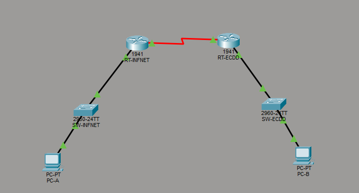

# Cisco Packet Tracer Labs

Este repositório contém laboratórios que desenvolvi utilizando o Cisco Packet Tracer.

## Laboratório 1

### Objetivo
Criar uma rede simples e testar a comunicação entre os dispositivos.

### Arquivos

- Lab_IPV6_Daniel.pkt
- Topologia.png

### Topologia

